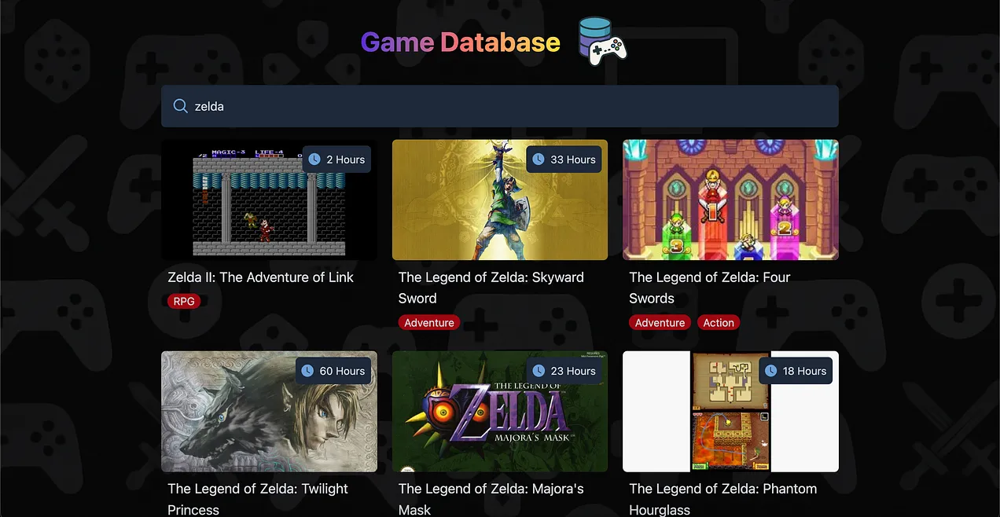

React is the most popular JavaScript “library” for building Web user interfaces. In this tutorial, I’ll teach the basics of React by building an app for searching games you might be interested in buying. I called it the Game Database. While this project is simple, it will teach you a lot about React and modern web development.

<!-- truncate -->



## Prerequisites

To follow this tutorial, you need to already know and have built projects with HTML, CSS, JavaScript and have basic knowledge of backend development (i.e You know what a REST API is). I also assume that you know how to use the terminal and a code editor like VSCode. Knowing how to work with Git is expected even if it’s not the focus of this tutorial.

## Tech Stack

While this tutorial is about using React, we will use other tools alongside it. You do not need to be familiar with them as I’ll explain how they work during the tutorial.

- Tailwind CSS : An easier way to write CSS to make our website look good.
- Node.js and Vite : So that our React code can be converted to JavaScript code that can run in the browser.
- RAWG API : This is an API for getting game related data. You can get a free API key here.
- Express.js : A Node.js web framework, This is so we can make a small backend that will serve as a proxy for getting data from the RAWG API. This is so we don’t leak our API key.

---

## What is Node.js and Why Do We Need it?

To setup our project, we first need Node.js. For those unfamiliar, Node is a runtime environment that let’s you run JavaScript code outside of the browser. Originally, JavaScript could only run within a web page within a browser but when Node was created, it enabled JavaScript to be used directly on your computer like for example Python.

This enabled, JS to be used for backend development as well.

Because JS was no longer constrainted by the browser, JavaScript with extra features started to emerge as people wanted certain features not yet included in browsers. This led to the creation of JSX which is the ability of writing HTML within JavaScript.

While this syntax is not valid in vanilla JS, developers would use build tools like Vite that would compile (or “transpile”) their Node.js JavaScript into JavaScript that runs in the browser.

To be more efficent, these build tools would also minify your code which consisted in compiling your multi-file JavaScript codebase into a single JavaScript file that looks like gibberish (or obfuscated) that would load faster in the browser since you would only needed to load a single file.

With Node.js also came NPM (The Node Package Manager) allowing programmers to install JavaScript libraries using the command line like you would do in other programming languages. Prior to this, you had to download a .js file for the library and import it using a script tag in your HTML.

All this to say, that we’re going to use Node.js to install React using NPM and use a build tool called Vite to transpile our React code which uses JSX (HTML that can be written within JS) into JS that runs in the browser.

## How to Set up React with Vite

First you need to install Node.js. If you don’t have it already, you can get it here. Installing Node.js will also install NPM which is crucial for installing React but also using the build tool Vite.

Now, create an empty folder which is going to contain the project. Using a terminal, navigate to this folder. Run the command :

```bash
npm create vite@latest .
```

This will use the latest version of vite to create your project and adding the . in the end will tell it to create the project within the current folder you’re in.

You’ll be prompted to select a framework, choose React and proceed. You’ll then be prompted to choose between JavaScript or TypeScript, select plain JavaScript since we’ll use JavaScript for this project.

Vite is now going to add a bunch of files in your project’s folder. You should have the following structure :

```text
game-database (or name of the folder you decided to use)
|- node_modules
|- public
    - vite.svg
|- src
    - assets
    - App.css
    - App.jsx
    - index.css
    - main.jsx
|- .gitignore
|- eslint.config.js
|- index.html
|- package-lock.json
|- package.json
|- README.md
|- vite.config.js
```

Once done, you’ll be told to run the following commands :

```bash
Done. Now run:

  npm install
  npm run dev
```

The first command installs the dependencies specified in a file called package.json which was created when vite scaffolded your project.

This file is very important since it keeps tracks of which versions of libraries your project depends on. If someone else where to set up your project on their machine, they would simply need to run npm install and they would get the right dependencies installed in their node_modules folder allowing them to have a working copy of your project.

Now if you run npm run dev you’ll start a local development server from which you can access your React app.

```bash
VITE v6.2.2  ready in 184 ms

  ➜  Local:   http://localhost:5173/
  ➜  Network: use --host to expose
  ➜  press h + enter to show help
```

## What is Tailwind and Why Do We Need it?

To make a website look good it’s essential to style it with CSS. However, there is a library called Tailwind which makes this easier than using regular CSS.

The way it works is that Tailwind offers a bunch of premade CSS classes that you use to style your HTML elements. For example :

``` html
<div class="w-full p-2 mt-4">
   Hello Tailwind!
</div>
```

Here we’re styling a div using the following Tailwind CSS classes : w-full, p-2 and mt-4.

w-full makes the element take the full available width within its parent.

p-2 adds a horizontal and vertical padding of 2 units (defined by Tailwind to be responsive so you don’t have to know what the unit actually is).

mt-4 adds a margin top of 4 units.

As you can see a lot of Tailwind CSS classes are straight up concepts from CSS. Even thought it might seem daunting to have to learn specific class names, most of the time you can figure the names out using your existing knowledge of CSS. When you can’t, the official docs are easy to navigate, so you can quickly find out what you need.

Another advantage of having styles defined this way, is that you can have an idea of what the element will look like by just looking in one place, the HTML. This makes it easy to iterate on your styles so you can achieve the look you want for your UI.

## How to Set Up Tailwind

Since Tailwind v4, setting it up has become way easier.

Open up a new terminal or simply close the web server started previously (You can do so with Ctrl+C) and run the following command :

```bash
npm install tailwindcss @tailwindcss/vite
```

Once done, you’ll have tailwind installed but for it to actually work in your project, you’ll need to modify your vite.config.js file so it includes Tailwind.

```js
import { defineConfig } from "vite";
import react from "@vitejs/plugin-react"; // <-- added
import tailwindcss from "@tailwindcss/vite"; //<-- added

// https://vite.dev/config/
export default defineConfig({
  plugins: [react(), tailwindcss()], // <-- added
});
```

Finally, go to your index.css file located under the src folder. Remove everything in it and add the following :

```css
@import "tailwindcss";
```

Now, Tailwind should be properly installed and is ready to be used.

## What is The RAWG API and Why Do We Need it?

RAWG is a video game database and they offer an API you can use for free but you need an API key. You can get one here after having first created an account on their platform. It’s free and you have a limit of 20000 requests per month.

As a heads up, you might be prompted to provide a domain for your product using their API before they give you access. If you don’t have one, simply provide the link to a GitHub repository were you plan on putting the source code for this tutorial or give the link of your GitHub account page. I did the latter and it worked.

In the end, you should have access to the API key under a page that looks like this.

## What to do if You Can’t Get an API Key?

In the case where for some reason you can not get access to an API key, you could still follow this tutorial by making made up data in the backend of our app.

## Why Do We Need a Backend?

While this tutorial is focused mainly on the frontend by teaching you how to build the app in React, we will still need a backend for this project. However, this backend will just serve as a proxy for calling the RAWG API.

You might be wondering, why don’t we simply call the API directly from the frontend, storing our API key in an environment variable and calling it a day?

The reason is that there is no secure way of storing an API key on the frontend. Even if you use environment variables in for example, Vite. The reason is that when your app is built for production, Vite will just inject the API key in your code. Someone, can still access it by using the devtools tab of their browser.

This might sound strange to some because a lot of tutorials on YouTube and elsewhere teach you to use environment variables client side to store your API key while mentioning that it’s the secure way to do it. However, this is unfortunately a false notion.

By having a small backend that acts as a proxy, we can call our backend from our frontend and let the backend call the RAWG API. Since the API key is store in the backend there will be no risks in having it leaked.

To build this backend we will use the Express Node.js web framework. While the backend is not the focus of this tutorial, I will explain what you need to understand as we do it.

For now let’s set up our backend under a new folder.

## How to Set Up Our Backend

This backend will be in a different folder as an independent project outside of our React app. Once you have created the folder (you can name it how ever you’d like. I named mine game-database-backend), cd into it with your terminal and run the command :

```bash
npm init -y
```

This will create a package.json file containing your project’s metadata. It should have the following content.

```json
{
  "name": "game-databse-backend",
  "version": "1.0.0",
  "main": "index.js",
  "scripts": {
    "test": "echo \"Error: no test specified\" && exit 1"
  },
  "keywords": [],
  "author": "",
  "license": "ISC",
  "description": ""
}
```

Before we can start installing the relevant dependencies, you need to add the following property to our package.json file.

```json
{
  "name": "game-databse-backend",
  "version": "1.0.0",
  "main": "index.js",
  "type": "module", // <-- add this line!
  "scripts": {
    "test": "echo \"Error: no test specified\" && exit 1"
  },
  "keywords": [],
  "author": "",
  "license": "ISC",
  "description": ""
}
```

Here we’re setting the type of imports to be of the type “module”. The reason we’re doing this is that in Node.js, we used to import libraries using the following syntax :

```js
const libraryA = require("libraryA"); 
```

This way of importing is called CommonJS. It was originally created when JavaScript didn’t have syntax to import libraries since at the time, you could only import libraries by adding a script tag to your HTML. When Node.js was created along with NPM, they needed a new syntax to import libraries using a single line. That’s why CommonJS was created.

As JavaScript in the browser evolved, they standardized on the ES Module syntax which looks like the following and works natively in browsers.

```js
import libraryA from "libraryA";
```

To be able to use this syntax in Node (since it’s not yet the standard in Node but is in browsers), you need to set the type to “module”.

You might have noticed in the package.json file, a property named “main”. This is where you specify what file is going to be the entry point of your codebase. By default it’s index.js. As you might notice, we don’t have an index.js file in our codebase yet so we need to create it. Leave it empty for now, we will fill it with code later on.

## Installing Dependencies

Now we need to install a few dependencies we need to create our backend. Run the following command to install all of them at once.

```bash
npm install express cors dotenv express-rate-limit node-fetch
```

Let’s go over each dependency to understand why they’re needed.

Express : This is a minimalist web framework allowing us to set up routes we can call from our Frontend. Essentially making our own API.

Cors : To be used with Express, it enables us to only allow requests from our frontend’s domain. Preventing other websites from calling our backend.

Dotenv : A dependency that allows Node.js to read environment variables.

Express-Rate-Limit : This enables us to protect our backend from DDoS attacks by limiting the number of requests a single client can make at once.

Node-fetch : Allows us to make requests to the RAWG API from our backend.

## Setting our API Key as an Environment Variable

Environment variable are useful because they allow you to provide secrets to your codebase without having to write it plainly in your code. This prevents leakage of secrets as well as allowing you to swap them in and out easily.

Since we’re currently setting up our backend. Create a .env file, with the following content. This is where you need to put your API key. The other fields aren’t important for now. We will come back to this later.

```ini
API_KEY=<Replace with your API key>
CLIENT_DOMAIN=<Replace with the client's domain for example : http://localhost:5173>
PORT=3000
```

Before proceeding, you absolutely need to create a .gitignore file and write .env in it. This is very important so that the Git version control system ignores your env file and doesn’t commit it to your repo. If you forget to do this, you might leak your API key in your source code when you’ll push it on, for example, GitHub.

You also need to write node_modules in it as it can clutter your commit history pretty quickly and anyways, the user pulling your code will have their own node_modules folder created when they run the command npm install.

We’re now ready to move on.

## How to Get The Project’s Assets

To make the website look good, I used a couple of images for icons, logos and for the site’s background. You can get all the assets I used for this project [here](https://github.com/JSLegendDev/Game-Database-Frontend/tree/main/public).

In your frontend repo, place the assets linked above in your public folder.

We’re ready to start working on the search page of the app which is the main page of the application.

In that page, the user should be able to use the search bar to search for a given game title or franchise and the app should call our backend which will call the RAWG API to retrieve a list of relevant games. Then, the app should display those games as cards containing a cover, a title, genres and how long it takes to beat the game if that data is available.

---

## How is React Initialized in Our Project?

If you look at your src folder, you should have the following files.

```text
src
|- assets
|- App.css
|- App.jsx
|- index.css
|- main.jsx
```

Before we write any code, let’s remove the assets folder and the App.css file. We don’t need these two. Since we’re using Tailwind, the only place we need for CSS is the index.css file.

Now let’s take a look at main.jsx.

```jsx
import { StrictMode } from 'react'
import { createRoot } from 'react-dom/client'
import './index.css'
import App from './App.jsx'

createRoot(document.getElementById('root')).render(
  <StrictMode>
    <App />
  </StrictMode>,
)
```

For React to be used in a webpage, it needs to inject the content of your app within your HTML. To be more precise, we first need to create a root within your index.html file from which your React app will be rendered.

If you take a look at your index.html file at the root of your project’s folder. You will notice the presence of a div with an id of “root”. This was added automatically by Vite.

```html
<!doctype html>
<html lang="en">
  <head>
    <meta charset="UTF-8" />
    <link rel="icon" type="image/svg+xml" href="/vite.svg" />
    <meta name="viewport" content="width=device-width, initial-scale=1.0" />
    <title>Vite + React</title>
  </head>
  <body>
    <div id="root"></div>
    <script type="module" src="/src/main.jsx"></script>
  </body>
</html>
```

Looking back at our React code :

```jsx
createRoot(document.getElementById('root')).render(
  <StrictMode>
    <App />
  </StrictMode>,
)
```

We can see that to inject our React app within the div having the id “root” we pass that div as a param of the createRoot function. It then creates an object that has a method called render . We immediately call it to pass our main React component called App wrapped under StrictMode (which adds useful behaviors to more easily find bugs).

## What are React Components?

The component is the main building block when working in React. It allows you to build UIs in a modular fashion allowing you to reuse components in multiple places. It also allows you to manage complexity by placing logic specific to a component within it.

At a basic level, a React component is just a JavaScript function that returns some JSX. Which, if you remember, is syntax that looks like HTML that you can write within JavaScript in a .jsx file.

Here is an example!

```jsx
function App(){ 
  return (
    <div>
      <h1>Hello World!</h1>
    </div>
  );
}
```

We have a React component that returns a div containing an h1 tag with the content “Hello World!”. You will surely notice that we defined this component by defining a function with its name’s first letter capitalized. The convention when defining React components is to use the PascalCase notation rather than the usual camelCase.

Another thing that makes components really useful in React is that you can place React components within React components, enabling a modular approach to building UIs. Here’s another example.

```jsx
function Card() {
  return <section>This is a card</section>
}

function App() {
  return (
    <div>
      <h1>Results</h1>
      <div>
        <Card />
      </div>
    </div>
  )
}
```

As you can see, to place a component within another you can use the self closing tag notation you’re used to from HTML along with the name of that component.

## React VS React-DOM

```jsx
import { StrictMode } from 'react'
import { createRoot } from 'react-dom/client'
```

Looking back at the import statements we had in main.jsx. You’ll notice that we’re importing things from both react and react-dom. You might be wondering why they are separate entities?

React is the library that allows us to build UIs using reusable blocks called components that return JSX. React-DOM on the other hand is the one taking care of rendering React components on the DOM (Document Object Model) of the webpage.

That’s why createRoot is imported from react-dom and not react since it’s used to render to the DOM with the render method. The reason for this split is that React can be used outside of the web. For example, it can be used for mobile development with React Native. Instead of the JSX being translated to HTML elements that are rendered on a webpage, they’re are translated to native mobile UI elements instead.

In addition to React being used for mobile UIs, it can also be used to make pdfs with react-pdf.

## Making Our First React Component

Now that you understand how components work, let’s define our first component, the App component.

If you take a look at main.jsx again, you’ll notice that we’re already importing this component from a file called App.jsx.

```jsx
import { StrictMode } from 'react'
import { createRoot } from 'react-dom/client'
import './index.css'
import App from './App.jsx' // <--

createRoot(document.getElementById('root')).render(
  <StrictMode>
    <App />
  </StrictMode>,
)
```

Let’s start from scratch by deleting everything in the existing App.jsx file and adding the following code which will display the app’s name and logo.

```jsx
export default function App() {
  return (
    <main className="w-full p-2 flex flex-col items-center">
      <div className="flex items-center">
        <h1>Game Database</h1>
        
      </div>
    </main>
  );
}
```

The main tag will contain all of the content of the search page. We define it as a flex container with a direction set to column. We then center the content within that main tag along the cross axis of the container using items-center. Below is a schematic displaying how the axis are defined according to the direction of the flex container. Remember that using items-center will center the content of the flex container along the cross axis while justify-center will center its content along the main axis.

We then make the main tag take the full available width of the page using w-full and give it a padding of 2 with p-2. All of the styling explained above is succinctly described in Tailwind by passing the needed class names to the className property of the JSX element.

```jsx
<main className="w-full p-2 flex flex-col items-center">
```

Now, you might be wondering why is it className instead of class that you’re accustomed to in HTML? The reason is that there is a difference in how the attribute is named in HTML vs the DOM which the underlying model representing a webpage. Since React operates on the DOM it was chosen to use className instead class which is what the DOM uses.

Now within the main tag, we define a div which will hold the app’s name and logo.

```html
<div className="flex items-center">
  <h1>Game Database</h1>
  
</div>
```

This div is set as a flex container with the direction set to row by default, so we don’t need to specify it. We center its content along the cross axis so that the app’s title and logo are near each other at the center.

We then use an img tag to display the logo. You might have noticed that the path to the image does not contain the public folder despite the image being in that folder. That’s because Vite will automatically make whatever is in the public folder as if it was available from the root of the project, so you do not need to specify the public folder in the path.

Finally w-25 and h-25 sets the size of the logo using units defined by Tailwind which are responsive.

If you now start a development server using the command npm run dev in your terminal, you should get the following result.

Let’s makes things prettier before moving on. In index.html add the following Tailwind classes to the body tag.

```html
<body class="bg-gray-950 bg-[url('./background.png')] bg-repeat">
```

We’re setting the background color to be of gray-950 which is a color predefined by Tailwind that is near black. We then set the background image and set it to repeat so that it tiles indefinitely making the image cover the page regardless of the size of the viewport.

You should have the following result.

As you can see the app’s name near the logo is not visible. To fix the issue, let’s add a nice looking gradient to it. To showcase how you can create custom classes composed of Tailwind classes, let’s add the following in our index.css file.

```css
.text-gradient {
  @apply bg-linear-to-r from-[#5c2bd9] via-[#fb6e6e] to-[#ffe137] bg-clip-text text-transparent;
}
```

The key here is to use the @apply directive and then use the Tailwind classes you need.

If you go back to our React component and apply the custom Tailwind class we created along with a few other Tailwind classes, you should get the following result.

```jsx
<h1 className="text-gradient text-4xl font-bold">Game Database</h1>
```

## Creating The Search Component

In the previous section we created our main React component acting as the entrypoint of our UI. However, we need to define more than just one component in our app. To keep things organized, let’s create a components folder under the src folder. Within, let’s define our next component, the Search component by creating a Search.jsx file.

```text
src
|- components
|    |- Search.jsx
|- App.jsx
|- main.jsx
|- index.css
```

Add the following code in Search.jsx.

```jsx
export default function Search({ query, onChange }) {
  return (
    <div className="w-full mb-4">
      <div className="flex my-2 rounded-md shadow-xl bg-gray-800 p-4">
        
        <input
          className="w-full focus:outline-none ml-2 text-gray-300"
          type="text"
          placeholder="Search a game"
          value={query}
          onChange={onChange}
        />
      </div>
    </div>
  );
}
```

The Search component is essentially a search bar. You’ll probably notice that we have params that are passed to this component. These are called props. It’s another one of React’s major concepts.

## What Are Props in React?

What makes components flexible in React is the ability to pass props to them to change how they’re rendered. This makes components usable in more than just one screen or one place in the app.

You can view props the same way as params that you pass to a function.

Here is a basic example of how props are used in React.

```jsx
function Title(props) {
  return <h1>{props.name}</h1>;
}

function App() {
  return (
     <div>
       <Title name="Hello World" />
     </div>
  );
}
```

To pass props to a component you can simply start adding arbitrary attributes to where you call this component. In the example above, I decided to use an attribute called “name” that is then available under the props object where the component is defined. That’s why I can do props.name and get access to “Hello World”.

You might have noticed that we use curly braces when putting prop.name within the h1 tag. This is important, so that the actual value, “Hello World” is what’s rendered rather than having literally “prop.name” displayed.

A more convenient way of dealing with props is to use destructuring which is a JavaScript concept allowing us to directly get the properties we need.

```jsx
function Title({name}) {
  return <h1>{name}</h1>
}
```

So now, if I need more than one prop, I can do the following.

```jsx
function Title({name, subtitle}){
  return (
    <div>
      <h1>{name}</h1>
      <h2>{subtitle}</h2>  
    </div>
  );
}

function App() {
  return (
    <div>
      <Title name="Hello World" subtitle="Hello World Again!" />
    </div>
  );
}
```

Now that you understand what props are and how they work, let’s further analyze the code for the Search component.

```jsx
export default function Search({ query, onChange }) {
  return (
    <div className="w-full mb-4">
      <div className="flex my-2 rounded-md shadow-xl bg-gray-800 p-4">
        
        <input
          className="w-full focus:outline-none ml-2 text-gray-300"
          type="text"
          placeholder="Search a game"
          value={query}
          onChange={onChange}
        />
      </div>
    </div>
  );
}
```

Most of the Tailwind classes here are easy to understand if you already know CSS so I will not go over each of them. I would like however, to explain a few that may not be as straightforward to figure out :

mb-4 : Applies 4 units to the bottom margin of the element. If you had ml instead, it would be applied for margin left, mr for margin right, etc…

my-2 : Applies 2 units to both the top and bottom margin of the element. Therefore, along the y axis. If you where to use mx, the left and right margins would be increased instead since they’re along the x axis.

Now let’s take a look at the input element.

```jsx
export default function Search({ query, onChange }) {
  return (
    {/* previous code omitted for clarity */}
        <input
          className="w-full focus:outline-none ml-2 text-gray-300"
          type="text"
          placeholder="Search a game"
          value={query} <--
          onChange={onChange} <--
        />
    {/* next code omitted for clarity */}
  );
}
```

In React, the input attribute has two properties that are very useful.

The value attribute allowing us to set the value inside the field.

The onChange attribute which takes a function and will run it every time the user types in the field. Which also allows us the get what was typed.

We pass to these two attributes the query and onChange props we defined for the Search component. Now, go back to App.jsx and add the following code.

```jsx
import { useState } from "react";
import Search from "./components/Search";

export default function App() {
  const [searchQuery, setSearchQuery] = useState("");

  return (
    <main className="w-full p-2 flex flex-col items-center">
      {/* previous code omitted for clarity */}
      <div className="w-full max-w-4xl">
        <Search
          query={searchQuery}
          onChange={(e) => setSearchQuery(e.target.value)}
        />
      </div>
    </main>
  );
}
```

What is this useState function we’re using? It’s called a hook and hooks are another one of React’s major concepts.

## What Are Hooks in React?

Hooks let you use different React features from your components. You can either use the built-in hooks or combine them to build your own.

The useState Hook

```jsx
const [searchQuery, setSearchQuery] = useState("");
```

Here in particular, we’re using a state hook to set a state variable with the goal of holding the user’s search query and to update the UI when it changes.

From React’s docs, the usefulness of the useState hook is made apparent.

To update a component with new data, two things need to happen:

1. Retain the data between renders.
2. Trigger React to render the component with new data (re-rendering).

Creating a state variable using the useState hook allows us to achieve both.

1. A state variable to retain the data between renders.
2. A state setter function to update the variable and trigger React to render the component again.

In our case, searchQuery is the state variable and setSearchQuery is the state setter function. Finally, we pass within useState() the default state value we want to use.

When creating a state variable here is the convention that is usually adopted.

```jsx
const [nameOfTheVariable, setNameOfTheVariable] = useState(<default value. can be a number, null, a string, etc...>);
```

What makes React convenient for building UIs rather than using vanilla JS is that you don’t need to manual update the UI by changing the content of various HTML nodes. As we saw above, by using a state variable, React will take care of updating the UI automatically when the state variable changes.

```jsx
<Search
  query={searchQuery}
  onChange={(e) => setSearchQuery(e.target.value)}
/>
```

By passing an onChange function that calls the state setter function setSearchQuery and passing to it the value of what was typed using e.target.value, we update the searchQuery state variable.

Since we’re also passing the searchQuery state variable to the Search component, React will re-render the component everytime it’s changed.

We could have defined the state variable within the Search component but it’s better to do it in the App component instead. This is a better approach because we need to have access to searchQuery so that we can pass it to our backend and make the RAWG API call to get relevant search results.

Now that the search bar is completed, let’s do some backend work to be able to query the RAWG API so it can provide the data we need.

## Setting Up Express

In your backend repo, add the following code to your index.js file.

```js
import express from "express";
import cors from "cors";
import rateLimit from "express-rate-limit";
import fetch from "node-fetch";
import dotenv from "dotenv";

dotenv.config(); 

const API_KEY = process.env.API_KEY;
if (!API_KEY) {
  throw new Error("API key not found in environment variables");
}
const app = express();

const corsOptions = {
  origin: process.env.CLIENT_DOMAIN,
  allowedHeaders: ["Content-Type", "Authorization"],
};

app.use(cors(corsOptions));

const limiter = rateLimit({
  windowMs: 15 * 60 * 1000, // 15 minutes
  max: 100, // Limit each IP to 100 requests per windowMs
  message: "Too many requests from this IP, please try again later.",
});

// Apply rate limiting to all API requests
app.use(limiter);
```

We first import all the needed packages. I explained why we needed each of them in part 1 of this tutorial. Refer to it here.

We then call dotenv.config() to load our environment variables. We can then access them using `process.env.<nameofthevariable>`

We intialize the express web framework which is the core of our backend and pass it to a const called app.

We then set our CORS (stands for Cross Origin Resource Sharing) options which allows us to only authorized requests coming from the domain of our frontend. One thing to know about CORS is that it’s only enforced through the web browser. That means, a mobile app could still make requests to our backend despite the options we set. Learn more about CORS here.

Using app.use(cors(corsOptions)), we apply the CORS options to our Express app.

Finally we set up our rate limiter preventing potential DDoS attacks where a client makes too many requests in order to take down our backend.

To make our backend actually do something let’s add the following code.

```js
app.get("/api/games", async (req, res) => {
    // TODO
});

const port = process.env.PORT || 3000;
app.listen(port, () => {
  console.log(`Server is running on port ${port}`);
});
```

We define our first route that the client will be able to call and then make the Express app run by using app.listen.

## Defining The /api/games Route

We want this route to return a list of games that matches the query passed by the client.

In Express, a route is defined this way.

```js
app.get("/api/games", async (req, res) => {
    // TODO
});
```

Here we’re using a GET route since we’re not modifying a resource, we’re just requesting it. The first param is the route path we want to use, while the second param contains the function that’s going to run when the request is made. req.query will contain the query of the client. Clientside, the query will be passed as a param to the route path. Here’s an example.

```js
/api/games?search=Zelda
Will result in req.query containing {search: “Zelda”}.
```

Now let’s continue by filling out the logic for the route.

```js
app.get("/api/games", async (req, res) => {
  const { search: searchQuery } = req.query;
 
  try {
    const response = await fetch(
      `https://api.rawg.io/api/games?key=${API_KEY}&search=${searchQuery}`,
      {
        method: "GET",
        headers: {
          //Authorization: `Bearer ${API_KEY}`, some APIs requires using the authorization header but not this one
          "Content-Type": "application/json",
        },
      }
    );

    if (!response.ok) {
      return res
      .status(500)
      .json({ error: "Failed to fetch data from external API" });
    }

    const data = await response.json();
    return res.json(data);

  } catch (error) {
    console.error(error);
    return res
      .status(500)
      .json({ error: "Failed to fetch data from external API" });
  }
});
```

Let’s break it down.

```js
const { search: searchQuery } = req.query;
```

By using object destructuring we rename the search param to searchQuery. We do this because the RAWG API expect a search param and it would look weird to do :

`https://api.rawg.io/api/games?key=${API_KEY}&search=${search}`

However, this is just a matter of personal preference. You can decide to stick with search if you want.

Within the Try/Catch statement we make the call to the RAWG API passing our API key from our environment variables.

```js
const response = await fetch(
    `https://api.rawg.io/api/games?key=${API_KEY}&search=${searchQuery}`,
    {
    method: "GET",
    headers: {
        //Authorization: `Bearer ${API_KEY}`, some APIs requires using the authorization header but not this one
        "Content-Type": "application/json",
    },
    }
);
```

Something to note is that the RAWG API expects you to pass the API key as a param rather than putting it in the Authorization header like other APIs. Also, in Node.js you can’t use fetch by default as you can on the frontend. That’s why we had to install the node-fetch package.

The rest of the code is pretty standard error handling. Either way, we always end up returning json with either an error message or the data the client requested.

Finally, remember to run the backend using the following command :

```bash
node index.js
```

## Fetching Search Data on The Frontend

Now that we have created the backend route we needed, let’s head back to our frontend to write the logic allowing us to fetch the relevant data according to what query the user entered in the search bar.

We need to first talk about another very important hook in React called useEffect.

## What is The useEffect Hook and How it Works?

To put it simply, it’s a hook that lets you synchronize a component with an external system. In our case it’s going to be our backend.

In practice, it’s a function that’s called within a component and takes usually two params. The first is the function you want to run which is your “effect” and the other is a dependency array. It will run after the component is first rendered and every time a dependency in its dependency array changes.

```jsx
import { useEffect } from "react";

export default function myComponent() {

  useEffect(() => {
     console.log("will run only once in prod and twice in dev");
  }, []);

  return <h1>Test</h1>;
}
```

Above is an example of how we use useEffect. We have an empty dependency array meaning that the effect will run only after the component renders the first time. This occurs once in prod but twice in development because we wrapped our app with StrictMode.

You can use useEffect without a dependency array but it will run after every render.

```jsx
useEffect(() => {
  console.log("This runs after every render");
});
```

## How is Data Fetched With useEffect?

```jsx
import { useState, useEffect } from "react";

function myComponent() {
  const [getNewQuote, setGetNewQuote] = useState(false);
  const [currentQuote, setCurrentQuote] = useState("");

  useEffect(() => {
    
    // prevent calling api after the component first renders
    if (!getNewQuote) return;

    // async function needed within because the function passed to useEffect cannot be async.
    const fetchData = async () => {
      const response = await fetch("https://example.com/api/quote");
      const data = await reponse.json()
      
      setCurrentQuote(data.text);
      setGetNewQuote(true);

    }
    fetchData();
  }, [getNewQuote]);

  return (
    <div>
      <h1>{currentQuote}</h1>
      <button onClick={() => setSearch(true)}>Display New Quote</button>
    </div>
  );

}
```

In the example above, we fetch and display a new quote from a fictitious API when the user clicks on a button. You’ll notice that the dependency array of our useEffect has the getNewQuote state variable. This means that the hook will run once after the component is rendered the first time (twice in dev because of StrictMode) and then every time getNewQuote is modified.

In practice, if you design your app in a way that you need the user to click a button to make an API call, you do not need to use useEffect as you could put the fetching logic within a function you pass to the button’s onClick handler. The example above was just to demonstrate at a basic level how this hook works.

In our app’s case, its usage is warranted since we need to make an API call when the user finishes typing something rather than clicking a button.

While using this hook like shown above is ok for toy examples, in practice when dealing with APIs, I would recommend using a library like Tanstack Query formerly known as React Query which makes fetching, caching, synchronizing and updating server state a breeze.

I recommend this part of the React docs regarding useEffect. Oftentimes, you might be tempted to use it while it’s not necessary. The docs provide helpful guidance regarding this hook.

In our app, we will still use useEffect but also create our own hook to deal with loading states (what to show the user while we’re fetching data) and error handling.

## Creating a Custom Hook

While React offers hooks like useEffect and useState, nothing prevents you from creating your own hook. This is what we’re going to do now. Our hook is going to be called useFetch and will be responsible for fetching the data we need from our backend and dealing with loading states and errors if they occur.

Create a new folder called hooks within the src folder and within a file called useFetch.js.

```text
src
|- components
|- hooks
    |- useFetch.js
```

In the file you just created, add the following code :

```jsx
import { useState } from "react";

export default function useFetch(fetchFunction) {
  const [data, setData] = useState(null);
  const [loading, setLoading] = useState(false);
  const [error, setError] = useState(null);

  const fetchData = async () => {
    try {
      setLoading(true);
      const result = await fetchFunction();
      setData(result);
    } catch (error) {
      setError(error);
    } finally {
      setLoading(false);
    }
  };

  const reset = () => {
    setData(null);
    setLoading(false);
    setError(null);
  };

  return { data, loading, error, fetchData, reset };
}
```

useFetch will expect a fetch function which will contain the API call and pass it to its own fetchData function and set the appropriate loading or error states depending ont the situation. The hook returns the data, the loading state, the error state, the fetchData function to fetch data again if needed and finally, a reset function to reset the state if needed.

Let’s create the fetch function specific to getting the list of games related to a search query. For this purpose, let’s create file called api.js within the src folder. In it, add the following code.

```js
const API_ENDPOINT = import.meta.env.VITE_API_ENDPOINT;

export async function fetchGames({ query }) {
  const response = await fetch(`${API_ENDPOINT}/games?search=${query}`);
  return await response.json();
}
```

For the code above to work we need to define an environment variable in our frontend. This is done just to make it easy to swap in and out the domain of the backend as needed and not for security reasons.

Create at the root of your project a .env file containing the domain of our backend.

```ini
VITE_API_ENDPOINT="http://localhost:3000/api"
```

Now, we can go to App.jsx where we will write the logic to fetch the needed data when the user enters a query in the search bar.

```jsx
import { useEffect, useState } from "react";
import useFetch from "./hooks/useFetch";
import { fetchGames } from "./api";

export default function App() {
  const [searchQuery, setSearchQuery] = useState("");

  const { data, loading, fetchData, error, reset } = useFetch(() =>
    fetchGames({ query: searchQuery })
  );

  useEffect(() => {
    const timeoutId = setTimeout(async () => {
      if (searchQuery.trim()) {
        await fetchData();
        return;
      }
    }, 500);

    return () => clearTimeout(timeoutId);
  }, [searchQuery]);

  return (
// ... rest of the code omitted for clarity
```

Let’s break it down.

```js
const [searchQuery, setSearchQuery] = useState("");
const { data, loading, fetchData, error, reset } = useFetch(() =>
    fetchGames({ query: searchQuery })
);
```

We call useFetch and pass to it an anonymous function that will call our fetchGames function created in the api.js file and pass to it the user’s search query. The reason we’re wrapping it in a function is that we don’t want to call fetchGames immediately but rather let useFetch call it in its fetchData function. We also couldn’t pass it on its own because we wouldn’t be able to pass the search query param along.

Once called, the useFetch hook will return all that we need to display the relevant UI depending on the situation.

```jsx
useEffect(() => {
    const timeoutId = setTimeout(async () => {
      if (searchQuery.trim()) {
        await fetchData();
      }
    }, 500);

    return () => clearTimeout(timeoutId);
}, [searchQuery]);
```

Next, we have our useEffect. We set a timeout of 500ms as to provide enough time after the user has typed before making a request otherwise we would be making a call every time a letter changes which would be wasteful. This is called debouncing.

Then, we have an if statement with a call to trim() that removes any whitespace at the beginning and end of a string. If the user didn’t type anything yet or just uses spaces in the search bar, an empty string will be returned which is falsy in JavaScript. Therefore, no API call will be made.

Since useEffect will run after the component first renders, in that case the search bar would be empty, we wouldn’t want to make an API call after all.

The function we pass to useEffect returns a function that clears the timeout we just created. This is called a cleanup function and is optional when using this hook but needed in our case. This is so we can avoid memory leaks. If we were to not use one here, every time the hook runs, we would create a new timer that would never be deleted.

That’s about it. The logic for fetching data is done. To make sure that it actually works, let’s console.log the data fetched. Below the useEffect we just added, create another one with the following content. (Yes, you can have more than one useEffect per component.)

```jsx
export default function App() {

  useEffect(() => {
    // code omitted ...
  }, [searchQuery]);

  useEffect(() => {
    if (data) console.log(data)
  }, [data]);

  return (
  //... code omitted
}
```

Make sure to re-run both the frontend with npm run dev and the backend with node index.js. Now, if you try using the app. You should get the following result.

---

## Creating The Game Card Component

After the user makes a search, we want to display a list of relevant games that will be rendered as a grid of cards where each card contains the game’s title, genres, cover image and the time it takes to complete the game if the data is available.

The first step to achieve this is to build a reusable game card component. Inside the components folder, create a file called GameCard.jsx.

Within that file, add the following code :

```jsx
export default function GameCard({
  coverLink,
  name,
  playtime,
  genres,
  onClick,
}) {
  return (
    <div className="flex-col relative" onClick={onClick}>
      

      <h1 className="p-2 text-gray-300 text-lg">{name}</h1>
      {playtime !== 0 && (
        <div className="flex items-center gap-2 mx-2 bg-gray-800 p-2 absolute top-2 right-0 rounded-md">
          
          <p className=" text-gray-300 text-sm whitespace-nowrap">
            {playtime} Hours
          </p>
        </div>
      )}

      <li className="flex flex-row flex-wrap gap-2 m-2 mt-auto">
        {genres.map((genre) => (
          <ul className="genre-pill" key={genre.name}>
            {genre.name}
          </ul>
        ))}
      </li>
    </div>
  );
}
```

We create a component with 5 props.

coverLink : The link of the cover image.

name : The name of the game.

playtime : How long the game takes to beat.

genres : An array containing the game’s genres.

onClick : A function that will run when the user clicks on a card.

Let’s break down the JSX returned by the component.

```jsx
<div className="flex-col relative" onClick={onClick}>
```

We the return a div that acts as the card container. We set is as a flex container and make it relative so that within, we will be able to place the playtime indicator at the top-right of the card using absolute positioning. We then set the onClick function passed as a prop to trigger when the container is clicked.

```jsx

```

We display the game’s cover using a simple img tag. First, the image is set to take the full available width with w-full . The height is set to 40 Tailwind units using h-40.

The object-cover Tailwind class is used to render the image in its original aspect ratio while still fitting within the width and height of the img tag. rounded-md stands for rounded medium and makes the corner of the image noticeably rounded.

```jsx
<h1 className="p-2 text-gray-300 text-lg">{name}</h1>
```

This h1 tag is used to display the game’s name.

```jsx
{playtime !== 0 && (
        <div className="flex items-center gap-2 mx-2 bg-gray-800 p-2 absolute top-2 right-0 rounded-md">
          
          <p className=" text-gray-300 text-sm whitespace-nowrap">
            {playtime} Hours
          </p>
        </div>
)}
```

We use conditional rendering to render the playtime indicator only if the playtime is above 0 hours. Usually, if it’s 0 then that means the playtime data for this game isn’t available. The RAWG API returns 0 in that case.

Using absolute positioning we’re able to place the indicator at the top-right corner of the game card by using absolute top-2 right-0.

## Conditional Rendering in React

There are many ways to achieve conditional rendering in React. Here are a few examples.

First example with an if statement.

```jsx
function myComp() {
  if (condition) {
    return (
      <div>
        <h1>B</h1>
      </div>
    );
  }

  return (
    <div>
      <h1>A</h1>
    </div>
  );
}
```

Second example with a boolean expression.

```jsx
function myComp() {
   return (
     <div>
       {condition && <h1>B</h1>}
       {!condition && <h1>A</h1>}
     </div>
   );
}
```

Third example, with a ternary operator.

```jsx
function myComp() {
   return (
     <div>
       {condition ? <h1>B</h1> : <h1>A</h1>}
     </div>
   );
}
```

If you want to achieve conditional rendering within JSX you can’t use an if statement and are forced to use either a boolean expression or a ternary operator. Between using a boolean expression or a ternary operator in the example above, the latter is better since we display “B” in the case the condition is true and “A” otherwise.

```jsx
{playtime !== 0 && (... rest of the code)}
```

However, in our game card component we display the playtime indicator only if its value is above 0 and nothing otherwise. Therefore, the boolean expression is more fitting for our use case.

```jsx
<li className="flex flex-row flex-wrap gap-2 m-2 mt-auto">
 {genres.map((genre) => (
    <ul className="genre-pill" key={genre.name}>
      {genre.name}
    </ul>
  ))}
</li>
```

Finally, we display the genres of the game. There can be more than one, that’s why we’re rendering this section as a list of items. Now has come the time to understand how lists are rendered in React.

Note that the class genre-pill is a custom class and you need to add it to your index.css file for it to work.

```css
.genre-pill {
  @apply bg-red-800 rounded-full px-2 text-gray-300 text-sm;
}
```

## How to Render Lists in React

It often occurs when working on Web UIs that you want to render multiple elements at once. For example, you want to render a list of search results, in our case, a bunch of game cards.

In React, you can achieve this by using the JavaScript .map function to iterate over an array and for each element return some JSX. At a basic level, it looks like this.

```jsx
function myComp() {
  const lines = ["Hello World!", "Foo", "Bar"];

  return (
    <ul>
      {lines.map((line) => <li>{line}</li>)}
    </ul>
  );
}
 {lines.map((line) => <li>{line}</li>)}
```

However, there is something missing in the code above. When rendering multiple elements, the rendered JSX elements need to be assigned a key. This is to enable React to establish a relationship between array elements and the corresponding JSX element. This becomes very important if items of the list are later added or removed. The key enables React to make the correct updates to the DOM.

You might come across React code using the index of the element as the key.

```jsx
{lines.map((line, index) => <li key={index}>{line}</li>)}
```

This is to be avoided when the array can change later down the line. For example, if the elements of the array are sorted in a different order, the relationship between the index and the JSX element will be broken.

To avoid this from happening, it’s usually best to use a consistent but unique key. Consistent in the sense that the key doesn’t change from render to render and unique so that no two elements in the list have the same key.

In our example above, the only key that would best fulfill these two conditions are the lines themselves.

```jsx
{lines.map((line) => <li key={line}>{line}</li>)}
```

If we assume that the data you want to display comes from a source that you control, you could have decided to assign a unique id for each item before sending the data to the client.

For example, let’s assume that each line of our lines array will have an id. You would have something like this :

```jsx
[{id: "u90909dfj89", content: "Hello World"}, ...]
```

You would use the id as the key.

```jsx
{lines.map((line) => <li key={line.id}>{line.content}</li>)}
```

Alternatively, with destructuring you would do :

```jsx
{lines.map(({id, content}) => <li key={id}>{content}</li>)}
```

For our genres, since the genre name is unique, we use the name for both the content of the list item and the key.

## Rendering a List of Game Cards

Now that we have finished the game card component, let’s use it in App.jsx to display relevant games when the search feature is used.

Add the following code :

```jsx
// previous code omitted for clarity
import GameCard from "./components/GameCard";

export default function App() {
  // previous code omitted for clarity

  const { data, loading, fetchData, error, reset } = useFetch(() =>
    fetchGames({ query: searchQuery })
  );

  // code omitted for clarity

  // second useEffect is no longer needed. This was just for testing purposes
  // useEffect(() => {
  //  if (data) console.log(data);
  // }, [data]);

  return (
    <main className="w-full p-2 flex flex-col items-center">
      {/* code omitted for clarity */}
      <div className="w-full max-w-4xl">
        <Search
          query={searchQuery}
          onChange={(e) => setSearchQuery(e.target.value)}
        />
        <div className="w-full">
          {data && (
            <div className="grid grid-cols-1 gap-5 sm:grid-cols-2 lg:grid-cols-3">
              {data.results.map(
                (game) =>
                  game.added > 30 && (
                    <GameCard
                      key={game.slug}
                      name={game.name}
                      coverLink={game.background_image}
                      playtime={game.playtime}
                      genres={game.genres}
                      onClick={() => {
                        console.log("test");
                      }}
                    />
                  )
              )}
            </div>
          )}
        </div>
      </div>
    </main>
  );
}
```

Let’s break it down.

```jsx
{data && (
  <div className="grid grid-cols-1 gap-5 sm:grid-cols-2 lg:grid-cols-3">
    {data.results.map(
      (game) =>
        game.added > 30 && (
          <GameCard
            key={game.slug}
            name={game.name}
            coverLink={game.background_image}
            playtime={game.playtime}
            genres={game.genres}
            onClick={() => {
              // TODO
              console.log("test");
            }}
          />
         )
       )}
  </div>
)}
```

We only render the game cards if the data is available. In that case, we first render a div which acts as a container for all game cards and is going to be displayed as a CSS grid.

grid grid-cols-1 gap-5 sm:grid-cols-2 lg:grid-cols-3
grid : sets the div as a grid container.

grid-cols-1 : sets the grid to have 1 column only.

gap-5 : sets a gap of 5 units between each elements in the grid.

sm:grid-cols-2 : sets the number of columns of the grid to be 2 on smaller screens and beyond. sm is a media query in Tailwind.

lg:grid-cols-3 : sets the number of columns of the grid to be 3 on larger screens and beyond. lg is also a media query in Tailwind.

```jsx
{data.results.map(
  (game) =>
    game.added > 30 && (
      <GameCard
        key={game.slug}
        name={game.name}
        coverLink={game.background_image}
        playtime={game.playtime}
        genres={game.genres}
        onClick={() => {
          // TODO
          console.log("test");
        }}
      />
    )
  )
}
```

We get the game cards data by doing data.results which returns an array. We then map over it to render each game card.

Before rendering a game card we make sure that the game has been added at least more than 30 times. The reason we’re doing this is that the RAWG API has the added property which determines how much a game was added. It doesn’t specify what added is exactly but I’ve noticed that if you just render what ever the array has you’ll often find yourself displaying cheap fangames and clones along side more legit titles. To show the best quality results as possible, I have figured out through testing that a game must have been added at least 30 times to be considered “legit”.

As mentioned previously when rendering an array in React you must provide a key for each element. Here is no exception. However, you might be wondering if we have to define a prop called key on the GameCard component before passing to it a key since it’s custom made and not a native JSX element? Fortunately, you don’t have to, it’s taken care of automatically by React.

Since the RAWG API returns a slug for each game, this will act as our unique key since it never changes for a specific game and is unique.

Now that we have added our game card list rendering logic, let’s test it out. Make sure to have your backend and frontend running with node index.js and npm run dev respectively.

## Handling Edge Cases and Improving The User Experience

While we were able to successfully display relevant results when a user makes a query there are still edge cases we aren’t handling.

## Displaying Error Messages in The UI

For example, what should be shown to the user if there are no games relevant to what they searched for?

In that case nothing is shown which isn’t a great user experience. To fix this, let’s add a message that will be displayed when no relevant search results are found.

Modifiy the code we had previously like shown below.

```jsx
<div className="w-full">
  {data && (
    <>
      <div className="grid grid-cols-1 gap-5 sm:grid-cols-2 lg:grid-cols-3">
        {data.results.map(
          (game) =>
            game.added > 30 && (
              <GameCard
                key={game.slug}
                name={game.name}
                coverLink={game.background_image}
                playtime={game.playtime}
                genres={game.genres}
                onClick={() => {
                  console.log("test");
                }}
              />
          )
        )}
       </div>
       {data.results.length === 0 && (
         <div className="w-full flex flex-col justify-center items-center">
           
           <p className="text-gray-300 text-2xl">No games found!</p>
         </div>
        )}
    </>
  )}
</div>
```

`<></>` is called a React fragment. This is useful when you don’t want to create an unnecessary div to wrap two or more elements at the same level. In our case we want the JSX for the search results and the JSX for the “No games found!” message to be both children of the container div having the className w-full. There is no need to wrap them under an additional div.

There’s still another edge case we haven’t taken into account. What if, for some reason, the app fails to retrieve data from the backend? Currently we show nothing in that case. However, the wise thing to do is to have some kind of error message displayed to the user.

Since this error message is going to have the same structure as the one we used for the “No games found!” message, let’s create a reusable component in the components folder. Create the file ErrorMessage.jsx with the following code.

```jsx
export default function ErrorMessage({ message }) {
  return (
    <div className="w-full  flex flex-col justify-center items-center">
      
      <p className="text-gray-300 text-2xl">{message}</p>
    </div>
  );
}
```

Now, we can use this component in App.jsx. Import the ErrorMessage component at the top of the file.

```jsx
import ErrorMessage from "./components/ErrorMessage";
```

Then, replace the JSX we used for the “No games found!” message.

From :

```jsx
{data.results.length === 0 && (
  <div className="w-full flex flex-col justify-center items-center">
    
    <p className="text-gray-300 text-2xl">No games found!</p>
  </div>
)}
to :

{data.results.length === 0 && (
  <ErrorMessage message={"No games found!"} />
)}
```

Let’s use the same component to display an error message when the apps fail to retrieve the data from the backend.

```jsx
// previous code omitted for clarity
<div className="w-full">
  {data && (...)}
  {error && <ErrorMessage message={"Network Error Occured!"} />}
</div>
```

Now, when a network error occurs, you’ll get the following UI.

## Adding a Loading Spinner

Another thing to improve upon is the fact that we give no indication to the user that the app is loading search results. Let’s add a spinner so that user doesn’t think the app has crashed.

Under the components folder create a file called Spinner.jsx and add the following code :

```jsx
export default function Spinner() {
  return (
    <div role="status">
      <svg
        aria-hidden="true"
        className="w-8 h-8 text-gray-200 animate-spin dark:text-gray-600 fill-blue-500"
        viewBox="0 0 100 101"
        fill="none"
        xmlns="http://www.w3.org/2000/svg"
      >
        <path
          d="M100 50.5908C100 78.2051 77.6142 100.591 50 100.591C22.3858 100.591 0 78.2051 0 50.5908C0 22.9766 22.3858 0.59082 50 0.59082C77.6142 0.59082 100 22.9766 100 50.5908ZM9.08144 50.5908C9.08144 73.1895 27.4013 91.5094 50 91.5094C72.5987 91.5094 90.9186 73.1895 90.9186 50.5908C90.9186 27.9921 72.5987 9.67226 50 9.67226C27.4013 9.67226 9.08144 27.9921 9.08144 50.5908Z"
          fill="currentColor"
        />
        <path
          d="M93.9676 39.0409C96.393 38.4038 97.8624 35.9116 97.0079 33.5539C95.2932 28.8227 92.871 24.3692 89.8167 20.348C85.8452 15.1192 80.8826 10.7238 75.2124 7.41289C69.5422 4.10194 63.2754 1.94025 56.7698 1.05124C51.7666 0.367541 46.6976 0.446843 41.7345 1.27873C39.2613 1.69328 37.813 4.19778 38.4501 6.62326C39.0873 9.04874 41.5694 10.4717 44.0505 10.1071C47.8511 9.54855 51.7191 9.52689 55.5402 10.0491C60.8642 10.7766 65.9928 12.5457 70.6331 15.2552C75.2735 17.9648 79.3347 21.5619 82.5849 25.841C84.9175 28.9121 86.7997 32.2913 88.1811 35.8758C89.083 38.2158 91.5421 39.6781 93.9676 39.0409Z"
          fill="currentFill"
        />
      </svg>
      <span className="sr-only">Loading...</span>
    </div>
  );
}
```

This component is based upon the loading spinner example found here. Most of it is SVG code. I will not explain how SVG work because it’s out of the scope of this tutorial. Let’s just use that spinner as is in our app.

In App.jsx, add the following code :

```jsx
// previous code omitted for clarity
import Spinner from "./components/Spinner";
```

Then, modify our existing code where we display the search results :

```jsx
<div className="w-full">
  {!loading ? (
    <>
      <div className="grid grid-cols-1 gap-5 sm:grid-cols-2 lg:grid-cols-3">
        {data?.results.map(
          (game) =>
            game.added > 30 && (
              <GameCard
                key={game.slug}
                name={game.name}
                coverLink={game.background_image}
                playtime={game.playtime}
                genres={game.genres}
                onClick={() => {
                  console.log("test");
                }}
              />
            )
         )}
       </div>
       {data?.results.length === 0 && (
         <ErrorMessage message={"No games found!"} />
       )}
    </>
   ) : (
    <div className="flex justify-center">
      <Spinner />
    </div>
  )}
  {error && <ErrorMessage message={"Network Error Occurred!"} />}
</div>
```

You’ll notice that we now have a ternary operator that determines whenever or not to show the spinner. If we aren’t in a loading state we render the grid or the error message. We use data? with the question mark as to only attempt to access the results property of the data object if it’s available.

Now, let’s test it out.

## Building The Game Details Component

The final part of this project consists in building the game details component which is a component that will display a dedicated section for a specific game after having clicked on its game card. In a production app, you would probably use a router like React Router and make it display as its own separate page.

However, I wanted to limit the use of third-party libraries, so I opted for displaying a component on the same page instead.

## Creating a New API Endpoint to Fetch More Data

Before we build that component, we need to write a new API endpoint in our backend to fetch data specific to a game. This endpoint will return a detailed description of the game. This wasn’t provided by the previous endpoint we had.

In your backend, add the following endpoint to your index.js file.

```js
app.get("/api/game", async (req, res) => {
  const { gameSlug } = req.query;

  try {
    const response = await fetch(
      `https://api.rawg.io/api/games/${gameSlug}?key=${API_KEY}`,
      {
        method: "GET",
        headers: {
          "Content-Type": "application/json",
        },
      }
    );

    if (!response.ok) {
      throw new Error("Failed to fetch data from external API");
    }

    const data = await response.json();

    return res.json(data);
  } catch (error) {
    console.error("Error fetching data from API:", error);
    return res
      .status(500)
      .json({ error: "Failed to fetch data from external API" });
  }
});
```

The first API endpoint returns, amongst other things, the game’s slug which we can use to query this second endpoint by passing it as a param.

Now restart the backend by doing Ctrl+C and running the command node index.js. Then, in our frontend, in the api.js file, add the following code :

```js
// previous code omitted for clarity

export async function fetchGameData({ gameSlug }) {
  const response = await fetch(`${API_ENDPOINT}/game?gameSlug=${gameSlug}`);
  return await response.json();
}
```

Finally, in the components folder, create a new file called GameDetails.jsx and add the following code.

```jsx
import { useEffect } from "react";
import useFetch from "../hooks/useFetch";
import { fetchGameData } from "../api";

export default function GameDetails({ currentGame, goBack }) {

   const { data, loading, fetchData, error, reset } = useFetch(() =>
     fetchGameData({ gameSlug: currentGame.slug })
   );

   useEffect(() => {
    (async () => {
      await fetchData();
    })();
   }, []);


   return (<section></section>);
}
```

We started things simple, by writing the logic to fetch the relevant data as soon as the component is rendered. We pass two props to the component. currentGame which is an object that contains the data previously fetched for a specific game. It contains the game’s slug (which is its id), genres, title, etc… We use the slug to fetch more data (the game’s detailed description).

The second prop is a function used to enable the user to go back to the search results if they wish to do so. Like mentioned earlier, in a production app, use something like React Router so that the user can use the back button of their browser to go back. This is called navigation and isn’t built into React by default, underlining the need for a third party library.

Our backend will return a description of the game and is formatted as a single long string. If we render it as is, it will not look good in the UI. That’s why we need to add the following utility function. Place it above where the GameDetails component is defined.

```jsx
// import statements should be here

function createParagraphs(inputString) {
  // Split the string into sentences using regex to match sentence-ending punctuation (., !, ?)
  const sentences = inputString.match(/[^.!?]+[.!?]+/g) || [];

  // Initialize an array to hold the paragraphs
  const paragraphs = [];

  // Loop through the sentences and create paragraphs with a max of 3 sentences
  for (let i = 0; i < sentences.length; i += 3) {
    // Join the next 3 sentences to form a paragraph
    const paragraph = sentences
      .slice(i, i + 3)
      .join(" ")
      .trim();
    paragraphs.push(paragraph);
  }

  return paragraphs;
}
```

```jsx
export default function GameDetails({ currentGame, goBack }) {
// rest of the code omitted for clarity
```

Now that we have this, we can modify our GameDetails component like so.

```jsx
import { useEffect, useState } from "react";
// ... other import statements

export default function GameDetails({ currentGame, goBack }) {
   const [description, setDescription] = useState([]);

   const { data, loading, fetchData, error, reset } = useFetch(() =>
     fetchGameData({ gameSlug: currentGame.slug })
   );

   useEffect(() => {
    (async () => {
      await fetchData();
    })();
   }, []);

   
   useEffect(() => {
    if (data) {
      const rawDescription = data.description_raw;
      const paragraphs = createParagraphs(rawDescription);

      setDescription(paragraphs);
    }
   }, [data]);
   


   return (<section></section>);
}
```

We create a state variable for holding the description and use a second useEffect to split the game’s description into paragraphs as soon as the data is available.

Let’s add more JSX but before, import the Spinner component we wrote previously.

```jsx
import Spinner from "./Spinner";
// previous code omitted for clarity
<section>
  <button className="main-button flex" onClick={goBack}>
     <span className="mx-2">Go Back</span>
  </button>

  {!data ? (
    <div className="flex justify-center mt-4">
      <Spinner />
    </div>
  ) : (
    <div className="mt-4">
      <div className="w-full relative">
        <div className="absolute inset-0 bg-gradient-to-b from-black via-transparent to-transparent opacity-80"></div>
        <h1 className="text-gray-200 text-2xl absolute top-5 left-5">
          {currentGame.name}
        </h1>
        
      </div>
      <div>
       
        <div className="text-gray-300">
          {description.map((paragraph, index) => (
            <p className="mt-2" key={index}>
              {paragraph}
            </p>
          ))}
        </div>
        

        <div className="w-full flex flex-col items-center p-4 h-96">
             TODO: Screenshot Carousel
        </div>

        <div className="grid grid-cols-2 py-4">
          <div className="flex flex-col">
            <h2 className="text-gray-300 text-xl">Genres</h2>
            <ul className="flex flex-wrap gap-2 py-2">
              {currentGame.genres.map((genre) => (
                <li className="genre-pill" key={genre.name}>
                  {genre.name}
                </li>
              ))}
            </ul>
            <h2 className="text-gray-300 text-xl">Platforms</h2>
            <ul className="flex flex-wrap gap-2 py-2">
              {currentGame.platforms.map((platform) => (
                <li key={platform.platform.name} className="platform-pill">
                  {platform.platform.name}
                </li>
              ))}
            </ul>
          </div>
          <div className="flex justify-center items-center">
            <button
              className="main-button flex items-center"
              onClick={() =>
                window.open(
                  `https://google.com/search?q=where+to+buy+${currentGame.name}`,
                  "_blank"
                )
              }>
               <span className="ml-4 mr-2">Purchase</span>
               
             </button>
          </div>
        </div>
      </div>
    </div>
  )}
</section>
```

Let’s break it down.

```jsx
<button className="main-button flex" onClick={goBack}>
     <span className="mx-2">Go Back</span>
</button>
```

This is the button placed at the top of the component allowing user’s to go back to the search results if they wish to do so. You’ll notice that we’re using a custom class called main-button. Add it to you index.css file. Also, add the platform-pill custom class which is used for displaying the various platforms the game can be played on as pill shaped blue “pills”.

```css
.main-button {
  @apply bg-blue-400 rounded-md p-2;
}

.platform-pill {
  @apply bg-blue-800 rounded-full px-2 text-gray-300 text-sm;
}
```

```jsx
{loading ? (
    <div className="flex justify-center mt-4">
      <Spinner />
    </div>
) : (...)}
```

We then use a ternary operator, to show a loading spinner while we’re fetching the description data for the game. Once loading is completed, we render some JSX containing a banner with the game’s cover and name followed by the game’s description rendered in multiple paragraphs. Then, we will render a screenshot carousel that will be its own separate component (We will write the code for it later) and finally, we render the list of genres of the game and the various platform you can play it on. Additionally, we render a button that will open up a google page with a query to determine where the user can purchase the game.

## Rendering The Game Details Component

Before proceeding with the screenshot carousel component, let’s first try to render the GameDetails component when a user clicks on a game card in the search results.

Add the following code to App.jsx.

```jsx
import GameDetails from "./components/GameDetails";

function App() {
  // ... code omitted for clarity

  const [showGameDetails, setShowGameDetails] = useState(false);
  const [currentGame, setCurrentGame] = useState(null);

  // ...
 
  return (
    // ...
    <div className="w-full">
        {!loading && !showGameDetails ? 
            (...) : 
            showGameDetails ?  (
        <GameDetails
            currentGame={currentGame}
            goBack={() => {
            setShowGameDetails(false);
            setCurrentGame(null);
            }}
        />
        ) : (
        <div className="flex justify-center">
            <Spinner />
        </div>
        )}
    </div>
       // ...

 )
```

Then, in the onClick of the GameCard components in App.jsx add the following.

```jsx
{data.results.map(
  (game) =>
    game.added > 30 && (
      <GameCard
        key={game.slug}
        name={game.name}
        coverLink={game.background_image}
        playtime={game.playtime}
        genres={game.genres}
        onClick={() => {
          setCurrentGame(game); // <--
          setShowGameDetails(true); // <--
        }}
      />
    )
)}
```

Now, if you run the app (make sure to restart the backend and the frontend) you should have the following results.

## Creating The Screenshot Carousel

The last component of this project consists in a screenshot carousel. In the components folder, create a file named ScreenshotCarousel.jsx and add the following code :

```jsx
import { useState, useEffect } from "react";

export default function ScreenshotCarousel({ screenshots }) {
  const [currentScreenshotIndex, setCurrentScreenshotIndex] = useState(0);

  useEffect(() => {
    // trick to preload the images
    for (const screenshot of screenshots) {
      const img = new Image();
      img.src = screenshot.image;
    }
  }, []);

  return (
    <div
      className="bg-gray-800 rounded-lg w-full h-full max-h-96 overflow-hidden relative"
    >
      <button
        className="bg-gray-200 rounded-full p-4 absolute top-40 right-5 shadow-gray-700 shadow-xl z-10"
        onClick={() => {
          setCurrentScreenshotIndex((currentScreenshotIndex) => {
            if (currentScreenshotIndex < screenshots.length - 1) {
              return currentScreenshotIndex + 1;
            }

            return 0;
          });
        }}
      ></button>
      <button
        className="bg-gray-200 rounded-full p-4 absolute top-40 left-5 shadow-gray-700 shadow-xl z-10"
        onClick={() => {
          setCurrentScreenshotIndex((currentScreenshotIndex) => {
            if (currentScreenshotIndex > 0) {
              return currentScreenshotIndex - 1;
            }

            return screenshots.length - 1;
          });
        }}
      ></button>

      
      

      <span className="bg-gray-900 rounded-full px-4 py-1 text-gray-300 text-xs absolute right-2 top-2 shadow-gray-700 shadow-xl">
        {currentScreenshotIndex + 1} / {screenshots.length}
      </span>
    </div>
  );
}
```

Let’s break it down.

```jsx
export default function ScreenshotCarousel({ screenshots }) {
We set a screenshots prop which will hold the array containing all screenshots of a given game.

const [currentScreenshotIndex, setCurrentScreenshotIndex] = useState(0);

useEffect(() => {
// trick to preload the images
  for (const screenshot of screenshots) {
    const img = new Image();
    img.src = screenshot.image;
  }
}, []);
```

We first declared a state variable for holding the index of the current screenshot being displayed.

We use a useEffect to preload all the screenshots. This is useful, so that when the user clicks on the arrow to look at the next image, they will see it instantly and won’t have to wait for it to load.

We return a div that acts as the screenshot carousel’s container. It has a background of bg-gray-800, rounded corners with rounded-lg (stands for rounded large), takes the full width available of the parent element with w-full, takes the full height but caps out at 96 units with h-full and max-h-96, prevents overflowing with overflow-hidden and is set to relative so we can absolute position the arrows.

```jsx
<button
  className="bg-gray-200 rounded-full p-4 absolute top-40 right-5 shadow-gray-700 shadow-xl z-10"
  onClick={() => {
    setCurrentScreenshotIndex((currentScreenshotIndex) => {
      if (currentScreenshotIndex < screenshots.length - 1) {
        return currentScreenshotIndex + 1;
      }

      return 0;
    });
  }}
></button>
<button
  className="bg-gray-200 rounded-full p-4 absolute top-40 left-5 shadow-gray-700 shadow-xl z-10"
  onClick={() => {
    setCurrentScreenshotIndex((currentScreenshotIndex) => {
      if (currentScreenshotIndex > 0) {
        return currentScreenshotIndex - 1;
      }

      return screenshots.length - 1;
    });
  }}
></button>  
```

Here, we added our two arrow buttons that allow the user to move back and forth. For both buttons their onClick handlers updates the screenshot index properly by making sure that we don’t go out of the bounds of the screenshots array.

Once the screenshot index is set, the carousel will re-render to display the correct image which is set here.

```jsx


```

The reason we have two img tags, is that the first one will act as the background and will be blurred while the second img tag displays the screenshot visible by the user.

We use object-cover for the first tag, so that the image will take all the available space in the container and we use object-contain in the second image so that the image retain its aspect ratio. Therefore, the user will be able to see the full screenshot without having part of it cropped out.

```jsx
<span className="bg-gray-900 rounded-full px-4 py-1 text-gray-300 text-xs absolute right-2 top-2 shadow-gray-700 shadow-xl">
  {currentScreenshotIndex + 1} / {screenshots.length}
</span>
```

Finally, we have a span tag which will render as a top-right indicator of which screenshot you’re currently viewing.

Now, that we have finished the carousel component, let’s add it in GameDetails.jsx.

First import the carousel at the top of the file.

```jsx
// previous code omitted for clarity
import ScreenshotCarousel from "./ScreenshotCarousel";
//Then, replace this :

<div className="w-full flex flex-col items-center p-4 h-96">
  TODO: Screenshot Carousel
</div>
With :

<div className="w-full flex flex-col items-center p-4 h-96">
  {currentGame.short_screenshots.length !== 0 && (
    <ScreenshotCarousel
      screenshots={currentGame.short_screenshots.slice(0)} // exclude the first screenshot since it's the same as the cover
    />
  )}
</div>
```

Now, if you run the project, you should get the following.
