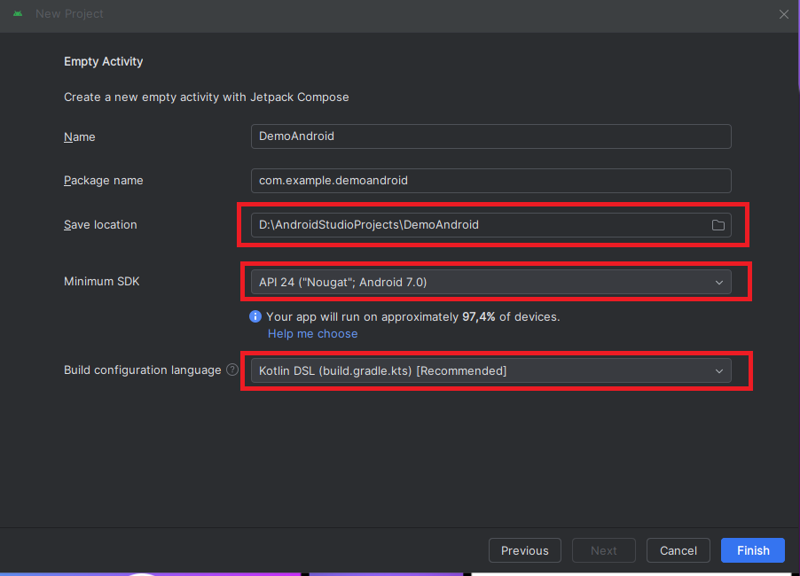
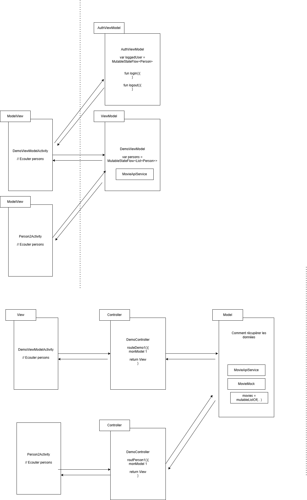
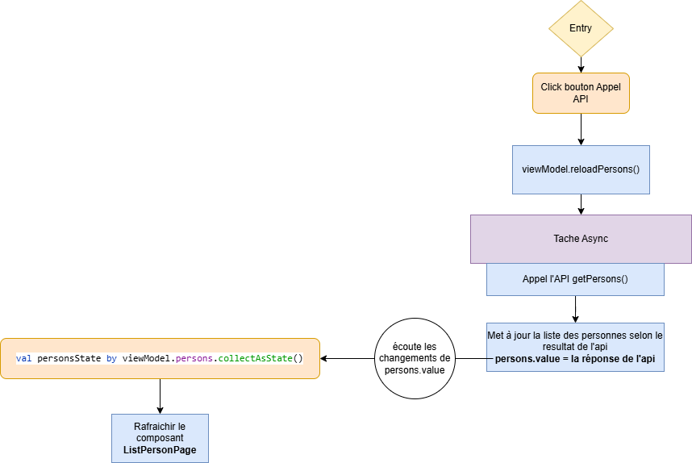
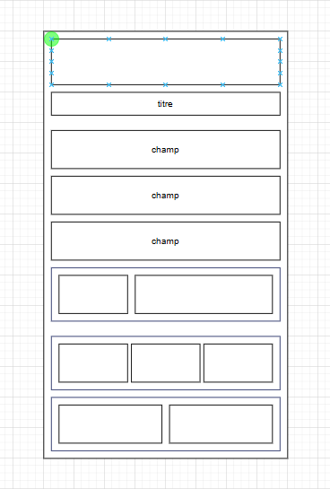
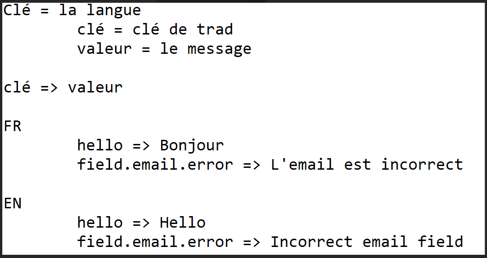

# Kotlin

---

**Android Jetpack Compose**

IDE: **Android Studio**

---

## Repos

- [DemoAndroid](https://github.com/antoinecoulon/DemoAndroid)
- [TpAndroid](https://github.com/antoinecoulon/TpAndroid)

## Ressources

- [Docs formateur ENI](https://chocolaterie.github.io/documentation/docs/category/android-kotlin)
- [Kotlin Playground](https://play.kotlinlang.org/) - Bac à sable Kotlin
- [GeeksforGeeks Tutorials](https://www.geeksforgeeks.org/android-jetpack-compose-tutorial/) - Divers tutos
- [Free Android Resources](https://dev.to/mjpasx/free-android-resources-52ec) - Cours, docs, ressources
- [Material Theme Builder](https://material-foundation.github.io/material-theme-builder/) - Constructeur de thèmes Material

---

## Doc

### Introduction

Android Physique = Utilisez le pour tester vos app (Il faut un cable USB, le mode dev d'activé)

Emulateur Android = Accelerateur materiel/emulation (HAXM, HyperV)

---

### Android Studio

Créer un projet:



---

### Workflow

> Créer une page = Créer une Activity
> 
> - Créer une classe kotlin vide
> - Copier-coller le minimum d'une activity existante (copier MainActivity dans l’exemple)
> - Ne pas oublier de renommer le nom de la classe Kotlin copiée-collée
> - Supprime tout ce que t'as fait sauf :
>     - le onCreate
>     - le preview
>     - le DemoPage (supprimer que le contenu de la page)
> - Renomme DemoPage par le context page actuel (ex: ArticlePage)
> - Pour que l'activity soit reconnu dans ton projet:
>     - L'ajouter dans le AndroidManifest.xml

---

### Learning

**Types:**
```kotlin
// String
val string: String = "Yasha Gozwan"

// Character
val char: Char = 'A'

// Integer Numbers
val byte: Byte = 122
val short: Short = 12_345
val int: Int = 1_234_567_891
val long: Long = 1_123_456_789_123_123_123L

// Float Numbers
val float: Float = 123.123F
val double: Double = 123.123

// Boolean
val isVerify: Boolean = false
val isSuccess: Boolean = true
```

**Strings:**
```kotlin
// String
val myStr = "Hello World"

// uppercase and lowercase
val upper = myStr.uppercase()
val lower = myStr.lowercase()

// Get length
// length
val myLength = myStr.length

// getting first and last character
val firstChar = myStr[0]
val lastChar = myStr[myStr.length - 1]
```

**String interpolation:**
```kotlin
// String Interpolation
val name = "Yasha"
val age = 26
println("Hello everyone. My name is $name and i $age old thanks")
```

**Getters / Setters**
```kotlin
// Les getters et setters sont implicites et peuvent être surchargés
newPerson.age //Getter
newPerson.age = 12 //Setter
```

```kotlin
class Person(var age: Int) {

	// Getters et setters explicites
	var age : Int = age
	get() = field
	set(value) {
		field = value
	}
}
```

```kotlin
//Doc pour les getter / setter
var <propertyName>[: <PropertyType>] [= <property_initializer>]
[<getter>]
[<setter>]
```

**Surcharge d'opérateurs**
```kotlin
operator fun plus(other: Person) : Person {
	this.age += other.age
	return this;
}
```
Ici on surcharge l'opérateur "+"

**Héritage**
```kotlin
open class Person(var age : Int){
	[...]
}

class Salary(var salaire : Int, var age : Int) : Person(age){
	[..]
}
```
La classe "Salary" hérite de la classe "Person" (on rappelle le constructeur)

**Components**
- Annotation Composable:
```kotlin
@Composable
fun DemoPage() { ... }
```

- Column:
```kotlin
Column {
    Text("Exemple...")          // Version à ne pas faire!
    Text(text = "Exemple...")   // Version explicite
}
```
<em>Bonne pratique:</em> déclarer les attributs pour éviter les erreurs à cause de l'ordre de déclaration ("text =")

- Row:
```kotlin
Column {
    Text(text = "Ligne 1")
    Text(text = "Ligne 2")
    Row {
        Text(text = "Ligne 3, col 1")
        Text(text = "Ligne 3, col 2")
    }
}
```

- Modifier:
```kotlin
Text(text = "...", modifier = Modifier.fillMaxWidth())
```

- Créer un composant:
```kotlin
@Composable
fun EniTextField(modifier: Modifier = Modifier, hintText : String = "") {
    TextField(
        value = "",
        onValueChange = {},
        modifier = modifier,
        placeholder = {
            Text(text = hintText)
        }
    )
}
```

**Routing**

Les deux fichiers suivants permettent de définir les routes, on les place dans un package "navigation":
```kotlin title="navigation/Screens.kt"
package com.example.tpandroid.navigation

sealed class Screens(val route: String) {
    object Home: Screens("home_screen")
    object Recovery: Screens("recovery_screen")
    object SignIn: Screens("signin_screen")
    object Articles: Screens("articles_screen")
}
```

```kotlin title="navigation/NavGraph.kt"
@Composable
fun NavGraph (navController: NavHostController){
    NavHost(navController = navController, startDestination = Screens.Home.route){
        composable(route = Screens.Home.route){
            HomeScreen(navController)
        }
        composable(route = Screens.Recovery.route){
            RecoveryScreen(navController)
        }
        composable(route = Screens.SignIn.route){
            SignInScreen(navController)
        }
        composable(route = Screens.Articles.route){
            ArticleScreen()
        }
    }
}
```

Dans la classe MainActivity, on ajoute:
```kotlin
setContent {
    TpAndroidTheme {
        // Ajout du navController
        Surface {
            val navController = rememberNavController()
            NavGraph(navController = navController)
        }
        
    }
}
```

Puis dans chaque screen:
```kotlin
@Composable
fun HomeScreen(navController: NavController) {}
```

**ViewModel**

Vulgarisation du ViewModel


**Webservices**

Ajouter les dépendances suivantes: 
```kotlin title="build.gradle.kts"
// Moshi
implementation(libs.moshi)
implementation(libs.moshi.kotlin)

// Retrofit
implementation(libs.retrofit)
implementation(libs.converter.moshi)

// Ok HTTP
implementation(libs.okhttp)
```

Créer une classe RetrofitTools:
```kotlin title="RetrofitTools.kt"
class RetrofitTools {

    // Kotlin :  companion object = tout ce qui est dedans est statics
    companion object{
        // La racine de l'api
        // val BASE_URL = "http://localhost:3000/"

        // La racine de l'api
        val BASE_URL = "http://161.35.39.34:3000/"

        // Pour les personnes emulateurs :
        //val BASE_URL = "http://10.0.2.2:3000/"

        // L'utilitaire conversion JSON <=> Objet
        val moshi = Moshi.Builder().add(KotlinJsonAdapterFactory()).build();

        // Retrofit
        val retrofit = Retrofit.Builder()
            .addConverterFactory(MoshiConverterFactory.create(moshi))
            .baseUrl(BASE_URL).build();
    }
}
```
Moshi permet de convertir du JSON. On créé une instance Retrofit qui va nous permettre d'appeler l'API. Le "companion object" est l'équivalent d'une classe statique, on peut l'appeler de n'importe où dans le projet.

Créer une interface qui permettra de déterminer les endpoints de l'API:
```kotlin title="PersonService.kt"
interface PersonService {
    @GET("persons.json") // Annotation pour savoir quelle URL appeler
    suspend fun getPersons(): List<Person>

    // Singleton Retrofit pour accéder au service: PersonApi.personService
    object PersonApi {
        val personService : PersonService by lazy { retrofit.create(PersonService::class.java) }
    }
}
```

Notre data class doit avoir la même structure que le JSON de l'API:
```kotlin title="Person.kt"
data class Person (
    var pseudo: String = "",
    var age: Int = 0
)
```

On retourne dans le ViewModel:
```kotlin title="ListPersonViewModel.kt"
class ListPersonViewModel: ViewModel() {
    // Liste de base, pas obligatoire !!!!
    var persons = MutableStateFlow<List<Person>>(mutableListOf(
        Person("titi", 360),
        Person("dddd", 45)
    ))

    /**
     * Fonction qui permet de charger la liste de personnes dans le view model
     */
    fun reloadPersons() {
        // Simulation de l'API = Obsolète
//        persons.value = mutableListOf(
//            Person("pipi", 360),
//            Person("popo", 45)
//        )

        // Coroutine (tâche asynchrone)
        viewModelScope.launch {
            // Appeler le service API
            // apiResponse = Retour de l'api
            val apiResponse = PersonService.PersonApi.personService.getPersons()
            
            // Remplacer la liste de personnes du ViewModel par celle de l'API
            persons.value = apiResponse
        }
    }
}
```

Ne pas oublier les permissions réseau/internet dans le manifest!!!
```xml title="AndroidManifest.xml"
<uses-permission android:name="android.permission.INTERNET" />
<uses-permission android:name="android.permission.ACCESS_NETWORK_STATE" />
```

On peut maintenant s'en servir dans la vue:
```kotlin title="ListPersonActivity.kt"
@Composable
fun ListPersonPage(viewModel: ListPersonViewModel){
    // J'écoute les changements de counter en temps réel
    val personsState by viewModel.persons.collectAsState()

    EniPage {
        Column(modifier = Modifier.padding(32.dp)) {

            WrapPadding {
                EniButton(buttonText = "Appel API", onClick ={
                    // Rafraichir les données
                    // = Appeler la fonction qui rafraichie les données dans le VM
                    viewModel.reloadPersons()
                })
            }

            LazyColumn {
                items(personsState) { person ->
                    Card(modifier = Modifier.padding(4.dp).border(1.dp, Color.Cyan, RoundedCornerShape(40.dp)), colors = CardDefaults.cardColors(Color.Transparent)) {
                        Text(
                            text = "Pseudo: ${person.pseudo}",
                            modifier = Modifier.fillMaxWidth(),
                            textAlign = TextAlign.Center,
                            color = Color.White,
                            fontWeight = FontWeight.Bold
                        )
                        Text(
                            text = "Age: ${person.age}",
                            modifier = Modifier.fillMaxWidth(),
                            textAlign = TextAlign.Center,
                            color = Color.White
                        )
                    }
                }
            }
        }
    }
}
```

Schéma:



---

### Design

KISS → Keep It Simple, Stupid



---

### Traduction



Un fichier strings.xml (dans res/values/) qui contient des combinaisons clé-texte:

```xml title="res/values/strings.xml"
<resources>
    <string name="app_name">TpAndroid</string>
    <string name="app_msg_credentials_aware">Please be aware when you enter credentials in the login page.</string>
    <string name="app_field_text_email">Email</string>
    <string name="app_field_text_password">Password</string>
    <string name="app_btn_text_forgot_password">I forgot my password !</string>
    <string name="app_btn_text_sign_in">Sign In</string>
    <string name="app_msg_no_account">Don\'t have an account ?</string>
    <string name="app_btn_text_register">Register now !</string>
    <string name="app_msg_welcome_registration">Welcome to the registration page.</string>
    <string name="app_field_text_pseudo">Pseudo</string>
</resources>
```

Et le nom des clés est utilisé dans nos fichiers à la place des textes, via stringResource()

```kotlin
Text(
      text = stringResource(R.string.app_msg_welcome_registration)
)
```
Facilite l'implémentation de différentes traductions