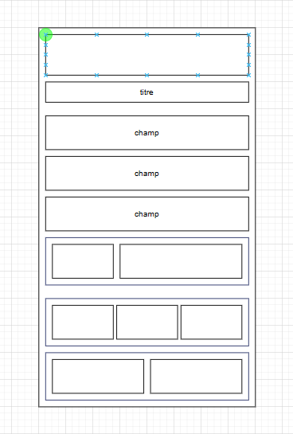

# Kotlin

**Android Jetpack Compose**

IDE: **Android Studio**

## Repos

- [DemoAndroid](https://github.com/antoinecoulon/DemoAndroid)
- [TpAndroid](https://github.com/antoinecoulon/TpAndroid)

## Ressources

- [Docs formateur ENI](https://chocolaterie.github.io/documentation/docs/category/android-kotlin)
- [Kotlin Playground](https://play.kotlinlang.org/) - Bac à sable Kotlin
- [GeeksforGeeks Tutorials](https://www.geeksforgeeks.org/android-jetpack-compose-tutorial/) - Divers tutos
- [Free Android Resources](https://dev.to/mjpasx/free-android-resources-52ec) - Cours, docs, ressources
- [Material Theme Builder](https://material-foundation.github.io/material-theme-builder/) - Constructeur de thèmes Material

## Doc
<!-- todo: Copier suite des cours  -->
### Introduction

Android Physique = Utilisez le pour tester vos app (Il faut un cable USB, le mode dev d'activé)

Emulateur Android = Accelerateur materiel/emulation (HAXM, HyperV)

### Workflow

> Créer une page = Créer une Activity
> 
> - Créer une classe kotlin vide
> - Copier-coller le minimum d'une activity existante (copier MainActivity dans l’exemple)
> - Ne pas oublier de renommer le nom de la classe Kotlin copiée-collée
> - Supprime tout ce que t'as fait sauf :
>     - le onCreate
>     - le preview
>     - le DemoPage (supprimer que le contenu de la page)
> - Renomme DemoPage par le context page actuel (ex: ArticlePage)
> - Pour que l'activity soit reconnu dans ton projet:
>     - L'ajouter dans le AndroidManifest.xml

### Design

KISS → Keep It Simple, Stupid



### Traduction


Un fichier strings.xml (dans res/values/) qui contient des combinaisons clé-texte:

```xml title="res/values/strings.xml"
<resources>
    <string name="app_name">TpAndroid</string>
    <string name="app_msg_credentials_aware">Please be aware when you enter credentials in the login page.</string>
    <string name="app_field_text_email">Email</string>
    <string name="app_field_text_password">Password</string>
    <string name="app_btn_text_forgot_password">I forgot my password !</string>
    <string name="app_btn_text_sign_in">Sign In</string>
    <string name="app_msg_no_account">Don\'t have an account ?</string>
    <string name="app_btn_text_register">Register now !</string>
    <string name="app_msg_welcome_registration">Welcome to the registration page.</string>
    <string name="app_field_text_pseudo">Pseudo</string>
</resources>
```

Et le nom des clés est utilisé dans nos fichiers à la place des textes, via stringResource()

```kotlin
Text(
      text = stringResource(R.string.app_msg_welcome_registration)
```
Facilite l'implémentation de différentes traductions