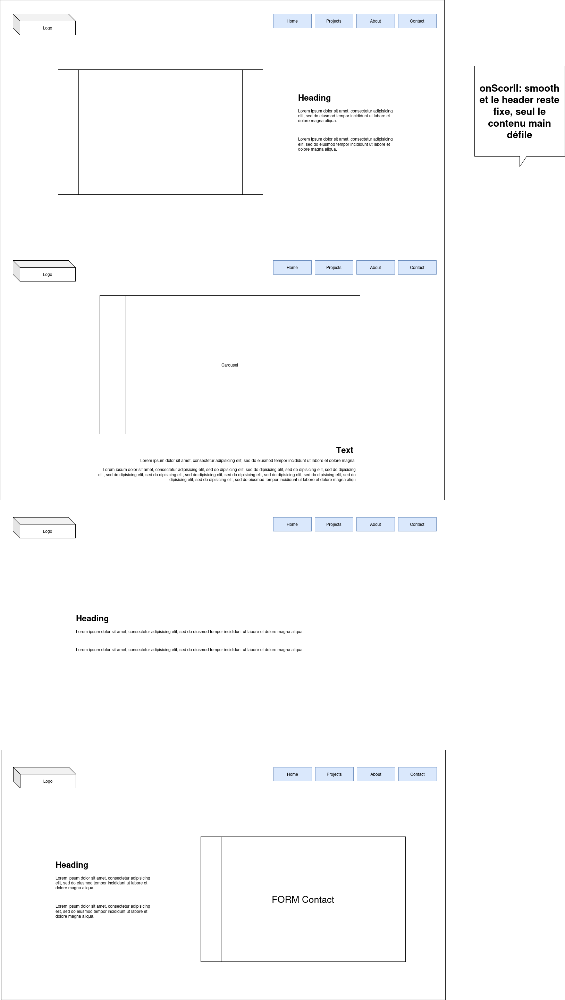

# Personal portfolio

---

- [Personal portfolio](#personal-portfolio)
  - [Conception](#conception)
    - [Maquette v1](#maquette-v1)
  - [Stack](#stack)
  - [Versions](#versions)
  - [Install](#install)
    - [pnpm](#pnpm)
    - [Vite](#vite)
    - [Tailwind](#tailwind)
    - [TS config](#ts-config)
    - [Vite config](#vite-config)
    - [Shadn](#shadn)
  - [Initialisation du repo Git](#initialisation-du-repo-git)
  - [Partie PROJETS](#partie-projets)

---

## Conception

### Maquette v1



---

## Stack

- React.js
- TypeScript

- Vite

- Tailwind CSS
- Shadn

---

## Versions

*v1 (todo):*

- [ ] Design de base (Header/Main/Footer)
- [x] Maquette
- [ ] Documentation
- [ ] Screens:
  - [ ] Home
  - [ ] Projets
  - [ ] About
  - [ ] Contact

---

## Install

### pnpm

Avoir `pnpm` installé:

```bash
pnpm -v
```

Sinon:

```bash
npm install -g pnpm@latest-10
```

### Vite

```bash
pnpm create vite@latest portfolio --template react-ts
```

### Tailwind

```bash
pnpm add tailwindcss @tailwindcss/vite
```

Remplacer tout dans `src/index.css` par:

```css title="src/index.css"
@import "tailwindcss";
```

### TS config

Ajoutez compilerOptions:

```json title="tsconfig.json
{
  "files": [],
  "references": [
    {
      "path": "./tsconfig.app.json"
    },
    {
      "path": "./tsconfig.node.json"
    }
  ],
  "compilerOptions": {
    "baseUrl": ".",
    "paths": {
      "@/*": ["./src/*"]
    }
  }
}
```

```json title="tsconfig.app.json
{
  "compilerOptions": {
    // ...
    "baseUrl": ".",
    "paths": {
      "@/*": [
        "./src/*"
      ]
    }
    // ...
  }
}
```

### Vite config

```bash
pnpm add -D @types/node
```

```ts title="vite.config.ts"
import path from "path"
import tailwindcss from "@tailwindcss/vite"
import react from "@vitejs/plugin-react"
import { defineConfig } from "vite"

// https://vite.dev/config/
export default defineConfig({
  plugins: [react(), tailwindcss()],
  resolve: {
    alias: {
      "@": path.resolve(__dirname, "./src"),
    },
  },
})
```

### Shadn

```bash
pnpm dlx shadcn@latest init
```

Vous pouvez maintenant ajouter des composants:

```bash
pnpm dlx shadcn@latest add button
```

Cette commande ajoute le composant `Button` au projet:

```tsx title="src/App.tsx"
import { Button } from "@/components/ui/button"

function App() {
  return (
    <div className="flex flex-col items-center justify-center min-h-svh">
      <Button>Click me</Button>
    </div>
  )
}

export default App
```

## Initialisation du repo Git

---

## Partie PROJETS

- portfolio
- chrome extension
- meme generator
- chef claude
- dice game
