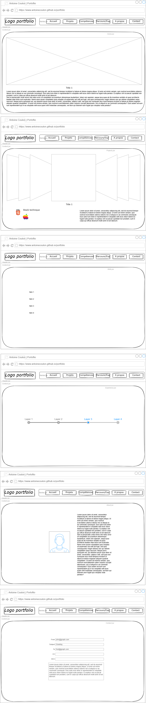

# Personal portfolio

---

- [Personal portfolio](#personal-portfolio)
  - [Conception](#conception)
    - [Maquette](#maquette)
      - [V1: Wireframe](#v1-wireframe)
  - [Stack technique](#stack-technique)
  - [Synthèse projet portfolio – Version 1 (phase 1)](#synthèse-projet-portfolio--version-1-phase-1)
    - [Objectif](#objectif)
    - [Cible](#cible)
    - [Structure initiale (Single Page Application avec ancrages ou routing)](#structure-initiale-single-page-application-avec-ancrages-ou-routing)
    - [Identité visuelle](#identité-visuelle)
  - [Versions](#versions)
  - [Étapes de développement (proposées comme une feuille de route Agile)](#étapes-de-développement-proposées-comme-une-feuille-de-route-agile)
    - [Sprint 0 – Initialisation du projet](#sprint-0--initialisation-du-projet)
    - [Sprint 1 - Accueil + layout global](#sprint-1---accueil--layout-global)
    - [Sprint 2 - A propos + Compétences](#sprint-2---a-propos--compétences)
    - [Sprint 3 - Projets (cards avec liens/captures)](#sprint-3---projets-cards-avec-lienscaptures)
    - [Sprint 4 - Expérience + certificats](#sprint-4---expérience--certificats)
    - [Sprint 4.5 - Replace Tailwind (v0.1.0)](#sprint-45---replace-tailwind-v010)
    - [Sprint 5 - Responsive, polish, refactor](#sprint-5---responsive-polish-refactor)
    - [Sprint 6 - Contact form](#sprint-6---contact-form)
    - [Sprint 7 - Remplir sections](#sprint-7---remplir-sections)
    - [Sprint 7.1 - Compléter About](#sprint-71---compléter-about)
    - [Sprint 7.2 - Refonte projet chrome extension](#sprint-72---refonte-projet-chrome-extension)
    - [Sprint 7.3 - Refonte projet meme generator](#sprint-73---refonte-projet-meme-generator)
    - [Sprint 7.4 - Refonte projet chef claude](#sprint-74---refonte-projet-chef-claude)
    - [Sprint 7.5 - Refonte projet dice game](#sprint-75---refonte-projet-dice-game)
    - [Sprint 7.6 - Refonte projet 2D game portfolio](#sprint-76---refonte-projet-2d-game-portfolio)
  - [TODO](#todo)

---

## Conception

### Maquette

#### V1: Wireframe



## Stack technique

- React + Vite
- Versioning Git avec des commits propres et fréquents
- Déploiement prévu sur GitHub pages

## Synthèse projet portfolio – Version 1 (phase 1)

### Objectif

Valoriser tes projets personnels et tes compétences techniques.

Vitrine évolutive : ajout de projets/certificats au fil du temps.

### Cible

Public non spécifique (donc UX claire, navigation intuitive, responsive first).

### Structure initiale (Single Page Application avec ancrages ou routing)

- **Accueil**: Introduction, titre accrocheur, lien vers projets
- **À propos**: Qui tu es, ton parcours, ta philosophie dev
- **Compétences**: Langages, frameworks, outils (pictos + niveaux éventuels)
- **Projets**: Liste filtrable ou classée, avec liens vers GitHub/démos
- **Parcours / Certifs**: Timeline ou cartes, avec captures
- **Contact**: En attente pour V2 (formulaire, backend léger)

### Identité visuelle

Style moderne & clean, inspiration développeur.

Couleurs et typographie : à définir ensemble (prochaine étape).

SPA avec routing.

Image de profil/avatar : plus tard.

Animations : à intégrer dans une future itération avec Framer Motion.

---

## Versions

**v1**
*v2:* -> Dark mode (upside/down?), Quotes

---

## Étapes de développement (proposées comme une feuille de route Agile)

- Sprint 0: Initialisation projet, structure, routing SPA
- Sprint 1: Accueil + layout global (Navbar/Footer)
- Sprint 2: À propos + Compétences
- Sprint 3: Projets (cards avec liens/captures)
- Sprint 4: Expérience + certificats
- Sprint 5: Responsive, polish, refactor
- Sprint 6 (bonus): Ajout de Framer Motion / backend formulaire de contact
- Sprint 7: refonte projets
- Sprint 8: dark mode, quotes

### Sprint 0 – Initialisation du projet

**Objectifs:**

[X] Créer la base du projet Vite avec React

Initialiser le projet avec Vite:

```bash
npm create vite@latest portfolio
```

> Choix:
>
> React
>
> JavaScript + SWC

```bash
cd portfolio
npm install
npm run dev
```

Les logo Vite et React doivent s'afficher sur [http://localhost:5173/].

Ensuite on peut clean les fichiers créés en ne gardant qu'une structure basique (bien penser à enlever tous les import et ce dans tous les fichiers).

[X] Organiser l’arborescence de projet (dossiers, routing, composants de base)

```arduino
node_modules/
public/
src/
├── components/     # composants réutilisables
├── pages/          # sections du portfolio (Accueil, À propos…)
├── routes/         # config du routing (si besoin)
├── data/           # données statiques (projets, skills…)
├── App.jsx         # structure principale
├── index.css       # fichier css principal 
├── main.jsx        # point d’entrée
.gitignore          # fichiers ignorés par Git
.eslint.config.js   # config Eslint
index.html          # point d'entrée html (balise #root)
package-lock.json
package.json
README.md
vite.config.js      # config Vite
```

[X] Versionner le projet sur GitHub

=> [Repo](https://github.com/antoinecoulon/portfolio)

[X] Déploiement auto Vercel

Ajouter le `base` dans la config Vite

```js
import { defineConfig } from 'vite'
import react from '@vitejs/plugin-react-swc'

export default defineConfig({
  plugins: [
    react(),
  ],
  base: '/portfolio/'
})
```

Importer le repo GitHub sur Vercel, c'est tout !

[Link](https://portfolio-antoinecoulon.vercel.app/)

[] Documentation Carbon (*README.md*)

[X] Projet GitHub avec Issues

[Link](https://github.com/users/antoinecoulon/projects/5)

---

### Sprint 1 - Accueil + layout global

- [X] Header
  - logo
- [X] Navbar
  - apparence
  - liens (voir Routing...)
- [X] Footer
- [X] Accueil
  - contenu (à continuer plus tard...)

---

### Sprint 2 - A propos + Compétences

- [X] Page 'A propos'
- [X] Page 'Compétences'
- [X] Routing
- [X] Adapter navbar (liens)

---

### Sprint 3 - Projets (cards avec liens/captures)

- [X] Page 'Projet'
  - [X] Accordeon placeholder

---

### Sprint 4 - Expérience + certificats

- [X] Page 'Parcours'
- [X] Timeline
  - Expériences formations

---

### Sprint 4.5 - Replace Tailwind (v0.1.0)

- [X] Fix all components CSS
  - [X] Home
  - [X] Projects: carousel
    - [react-awesome-slider](https://github.com/rcaferati/react-awesome-slider) ? Non, deprecated
    - [swiperjs](https://swiperjs.com/) ? YES
  - [X] Compétences
    - [keen-slider](https://keen-slider.io/examples) ? Carousel 360
  - [X] Parcours
    - [chakraUI timeline](https://www.chakra-ui.com/docs/components/timeline#examples)
  - [X] A propos
  - [X] Vérifier que les classes Tailwind ne trainent pas

---

### Sprint 5 - Responsive, polish, refactor

- [X] Partie PROJETS
- [X] Partie PARCOURS - Retravailler timeline
- [X] Partie ABOUT - Photo + text
- [X] Partie SKILLS - Vrais données
- [X] Partie HOME - Changer police ?

---

### Sprint 6 - Contact form

- [X] Form contact basique
- [X] Responsive

---

### Sprint 7 - Remplir sections

- [] Remplir sections avec de vraies données
  - [X] Home
  - [] Projects
    - [] Refaire les projets, + perso, français, opérationnels
      - portfolio
      - [X] chrome extension
      - [X] meme generator
      - [X] chef claude
      - [] dice game
  - [X] Skills
  - [X] Parcours
  - [X] About
  - [X] Contact

### Sprint 7.1 - Compléter About

- [X] Certificats
- [X] Liens

### Sprint 7.2 - Refonte projet chrome extension

- [X] Refonte projet

### Sprint 7.3 - Refonte projet meme generator

- [X] Refonte projet

### Sprint 7.4 - Refonte projet chef claude

- [X] Refonte projet

### Sprint 7.5 - Refonte projet dice game

- [] Refonte projet

### Sprint 7.6 - Refonte projet 2D game portfolio

## TODO

- dark/light mode
- Transition slides smooth
- Fix problème actualisation
- Bonus Contact
- Bonus Parcours (experience)
- Sur écran large, passer en paysage
